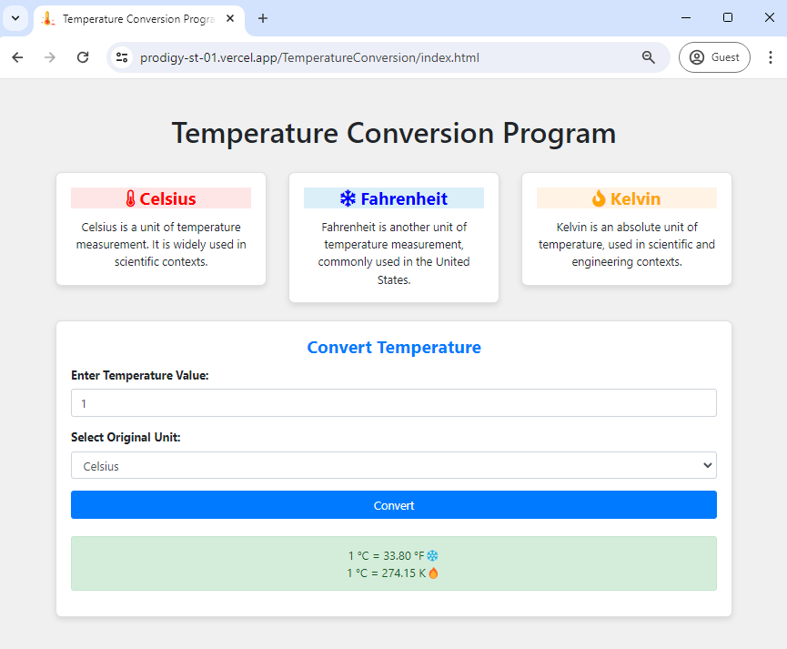
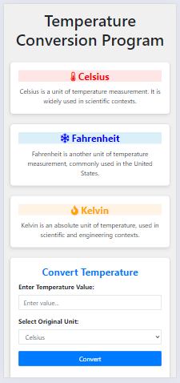

# PRODIGY_ST_01
Temperature Conversion Program ( Celsius | Fahrenheit | Kelvin )

## Task 1: Build a Temperature Conversion Program

### Objective:

Create a program that converts temperatures between Celsius, Fahrenheit, and Kelvin scales. The program should prompt the user to input a temperature value and the original unit of measurement. It will then convert the temperature to the other two units and display the converted values to the user. For example, if the user enters a value of 25 degrees Celsius, the program should convert it to Fahrenheit and Kelvin, and present the converted values as outputs.

### Requirements:

- User-driven application with a graphical user interface (GUI)
- Prompt the user to input a temperature value and select the original unit of measurement
- Convert the input temperature to the other two units (Celsius, Fahrenheit, Kelvin)
- Display the converted values to the user

### Languages and Tools:

- JavaScript/HTML/CSS: Create a web-based application using Bootstrap framework

### Visualization:

*Desktop View*

*Smartphone View*
